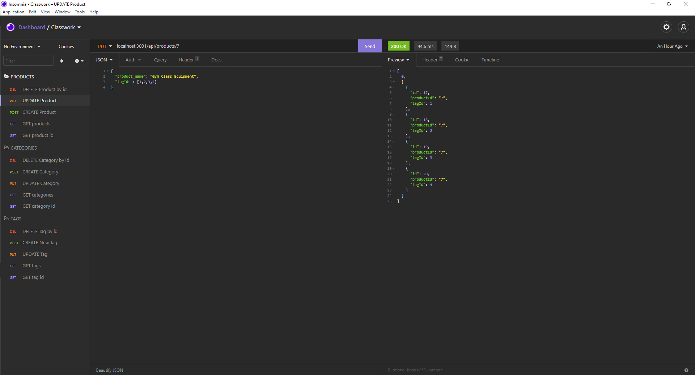

# E-Commerce Back End
## Description

The E-Commerce Back End API is an Insomnia tested API utilizing Express and Sequelize to manage data for a hypothetical E-Commerce inventory. The motivation for this project was to design API calls and database queries to manage data for an E-Commerce site. This project was built to demonstrate the Object-Relational Mapping (ORM) utilized for database storage and API calls. I utilized my skills developing models in Sequelize, using Express to set up routes, and testing the responses in Insomnia to complete this project. 

## Table of Contents 
- [Installation](#installation)
- [Usage](#usage)
- [Credits](#credits)
- [License](#license)

## Installation
To install the E-Commerce Back End, first download the files from the Github repo, open a terminal inside the appropriate folder, and run "npm install" (or just install inquirer and fs).
Run the SQL files (either in a MySQL shell or inside Workbench). 

## Usage

To use the E-Commerce Back End, first seed the database (if you have not already) by typing "npm run seed" in an integrated terminal. Next, deploy the server by entering "node server.js" in the terminal. Now that the server is listening, the best way to test the routes is to use your preferred API Client (I personally used Insomnia for this project). Make the appropriate API calls to the appropriate localhost port, and you should get responses with product, category, and tag information from the database. 

## Credits
The Github repository resides at https://github.com/tjtahmas/E-Commerce-Back-End

You can contact me with any questions or comments about the project at tjtahmas@gmail.com

## License

MIT License

Copyright (c) 2021 Thomas Tahmassebi

Permission is hereby granted, free of charge, to any person obtaining a copy
of this software and associated documentation files (the "Software"), to deal
in the Software without restriction, including without limitation the rights
to use, copy, modify, merge, publish, distribute, sublicense, and/or sell
copies of the Software, and to permit persons to whom the Software is
furnished to do so, subject to the following conditions:

The above copyright notice and this permission notice shall be included in all
copies or substantial portions of the Software.

THE SOFTWARE IS PROVIDED "AS IS", WITHOUT WARRANTY OF ANY KIND, EXPRESS OR
IMPLIED, INCLUDING BUT NOT LIMITED TO THE WARRANTIES OF MERCHANTABILITY,
FITNESS FOR A PARTICULAR PURPOSE AND NONINFRINGEMENT. IN NO EVENT SHALL THE
AUTHORS OR COPYRIGHT HOLDERS BE LIABLE FOR ANY CLAIM, DAMAGES OR OTHER
LIABILITY, WHETHER IN AN ACTION OF CONTRACT, TORT OR OTHERWISE, ARISING FROM,
OUT OF OR IN CONNECTION WITH THE SOFTWARE OR THE USE OR OTHER DEALINGS IN THE
SOFTWARE.
---